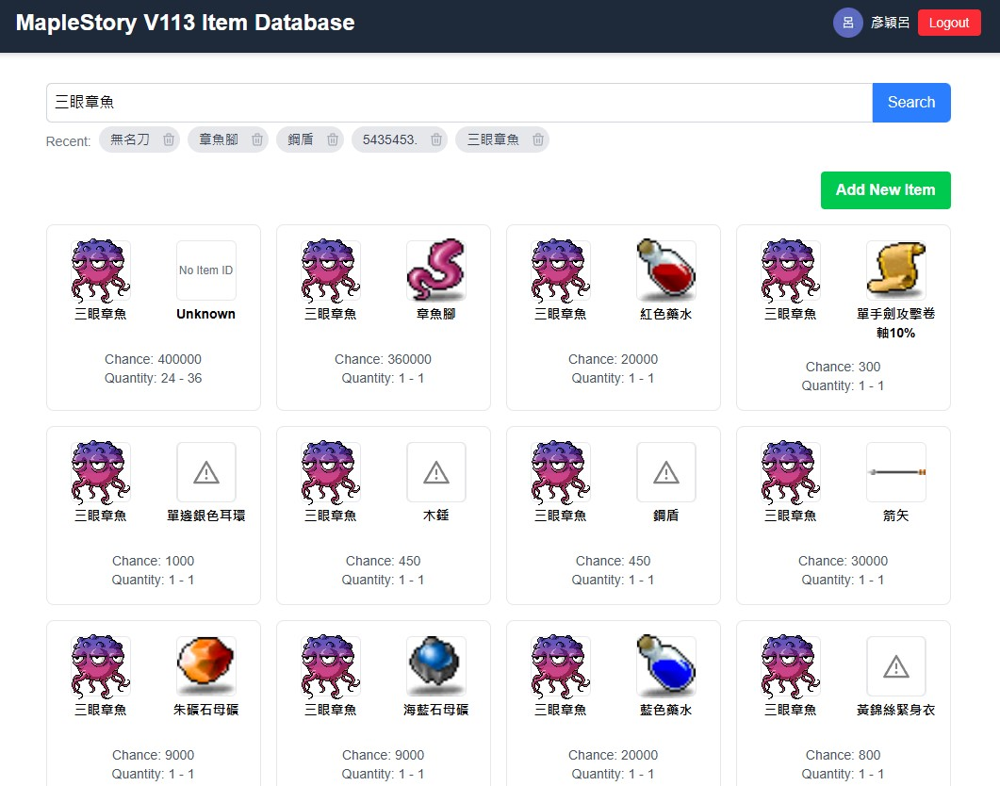
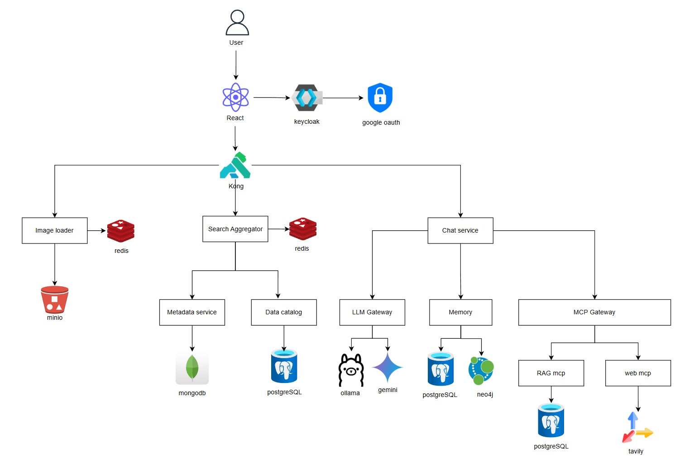

# MapleStory Drop Data Microservice Monorepo

[](https://nextjs.org/) [](https://fastapi.tiangolo.com/) [](https://www.docker.com/) [](https://kubernetes.io)

A comprehensive monorepo project showcasing a microservice architecture. This system provides a modern, high-performance interface to query, manage, and interact with MapleStory drop data, augmented by a Large Language Model (LLM) for natural language queries.

## Demo

**Live Demo**: [microservice-template.mydormroom.dpdns.org](https://microservice-template.mydormroom.dpdns.org/)



---

## System Design

The project is architected around a set of independent, containerized microservices that communicate via an API Gateway. This design promotes scalability, separation of concerns, and maintainability.



## Advanced Architecture: LLM and Tool Integration

The core of this project's intelligence lies in its sophisticated integration of Large Language Models (LLMs) and external tools, orchestrated by the `ms-llm-orchestrator` service. This is achieved through two specialized gateways:

#### 1. LiteLLM Gateway
-   **Purpose**: Acts as a universal API translator for over 100 LLM providers. It allows the application to switch between different models without changing any code in the orchestrator service.
-   **Workflow**:
    - `ms-llm-orchestrator` sends all chat requests to the LiteLLM gateway's OpenAI-compatible endpoint.
    - LiteLLM translates this request into the native format for the target model (e.g., Google's Gemini, an open-source model like Llama 3 hosted on Ollama, or a commercial provider like OpenAI's GPT series).
-   **Benefit**: This provides extreme flexibility, avoids vendor lock-in, and allows for easy experimentation with different models to balance cost, performance, and capabilities.

#### 2. MCP (Multi-Context Platform) Gateway
-   **Purpose**: Exposes external services and data sources as a standardized set of "tools" that the LangChain agent can use. This is the foundation of the Retrieval-Augmented Generation (RAG) and agentic capabilities of the system.
-   **Workflow**:
    - `ms-llm-orchestrator` queries the MCP gateway on startup to retrieve a list of available tools.
    - These tools can include a **RAG service** (for fetching context from a vector database), a **web search service**, or any other custom API.
    - When a user's prompt requires information that the LLM doesn't have (e.g., "What are the latest drops for X monster?"), the agent can decide to use one of these tools. The request is sent to the MCP gateway, which routes it to the appropriate downstream service.
-   **Benefit**: This makes the LLM "smarter" by giving it access to real-time, domain-specific information and the ability to interact with the outside world.

## Key Features

-   **Advanced Search**: Aggregated search functionality across multiple data sources.
-   **LLM-Powered Chatbot**: Query drop information using natural language through a flexible RAG pipeline powered by LiteLLM and MCP gateways.
-   **Data Management**: Full CRUD (Create, Read, Update, Delete) operations for drop data.
-   **Image Service**: Dynamic retrieval and caching of in-game mob and item images.
-   **API Gateway**: Centralized and secure API management via Kong.
-   **Authentication**: All backend API endpoints are secured with JWT and validated against a Keycloak identity provider.
-   **Fully Containerized**: Simplified local development setup using Docker and Docker Compose.
-   **CI/CD Ready**: Pre-configured GitLab CI pipeline for automated testing, building, and deployment.

## Technology Stack

-   **Frontend**: Next.js, React, TypeScript, Tailwind CSS
-   **Backend**: Python 3.11, FastAPI, LangChain
-   **LLM Integration**: LiteLLM, MCP (Multi-Context Platform), LangChain
-   **API Gateway**: Kong
-   **Databases & Storage**:
    -   **MySQL**: Primary data store for `ms-maple-drop-repo`.
    -   **MongoDB**: Data store for `ms-name-resolver`.
    -   **Redis**: Caching layer for `ms-search-aggregator` and `ms-image-retriever`.
    -   **MinIO**: S3-compatible object storage for images.
-   **Containerization**: Docker, Docker Compose
-   **CI/CD**: GitLab CI
-   **Deployment**: Kubernetes (manifests managed with Kustomize)
-   **Package Management (Python)**: `uv`

---

## Architecture and Services

| Service Name | Technology | Description |
| :--- | :--- | :--- |
| `frontend` | Next.js | The user-facing application for searching, data management, and chatbot interaction. |
| `kong` | Kong | API Gateway handling routing, load balancing, and JWT authentication for all backend services. |
| `ms-llm-orchestrator` | FastAPI, LangChain | The "brain" of the application. Orchestrates LLM responses by routing calls through the **LiteLLM Gateway** and using tools (like RAG and web search) provided by the **MCP Gateway**. |
| `ms-search-aggregator` | FastAPI | **Search Coordinator**. Aggregates data from other services to provide comprehensive search results. |
| `ms-maple-drop-repo` | FastAPI, MySQL | The primary repository for drop data, providing CRUD APIs. |
| `ms-name-resolver` | FastAPI, MongoDB | Resolves game entity names (mob, item) to their corresponding IDs and vice-versa. |
| `ms-image-retriever` | FastAPI, MinIO | Retrieves and checks for the existence of images from MinIO object storage. |

---

## Local Development Setup

### Prerequisites

-   [Docker](https://www.docker.com/products/docker-desktop/) and Docker Compose
-   [Git](https://git-scm.com/)

### 1. Clone the Repository

```bash
git clone <your-repository-url>
cd microservice_template
```

### 2. Configure Environment Variables

Create a file named `.env` in the project root. This file contains secrets and settings required by `docker-compose.yml`. Note that the local Docker Compose setup expects several backing services (Postgres, MySQL, MinIO, Redis) to be running externally.

**`.env` Template:**
```env
# Password for the Postgres database (used by Kong migrations)
POSTGRES_PASSWORD=your_postgres_password

# Credentials for the MySQL database used by ms-maple-drop-repo
ITEM_DATA_DB_PASSWORD=your_mysql_password

# Credentials for MinIO object storage used by ms-image-retriever
MINIO_ROOT_PASSWORD=your_minio_password

# Password for the Redis cache services
REDIS_PASSWORD=your_redis_password

# Secrets for the LLM Orchestrator
LITELLM_API_KEY=your_litellm_key
LANGFUSE_PUBLIC_KEY=your_langfuse_public_key
LANGFUSE_SECRET_KEY=your_langfuse_secret_key
LANGFUSE_BASE_URL=your_langfuse_url
MCP_TOKEN=your_mcp_token
```

### 3. Run All Services

Execute the following command in the project root to build and start all services defined in the `docker-compose.yml` file.

```bash
docker-compose up --build -d
```
-   `--build`: Forces a rebuild of the Docker images if their source has changed.
-   `-d`: Runs the containers in detached mode (in the background).

### 4. Accessing Services

-   **Frontend Application**: [http://localhost:30102](http://localhost:30102)
-   **Kong Admin API**: [http://localhost:8001](http://localhost:8001) (useful for checking API Gateway status and configuration)
-   **LLM Orchestrator (Direct)**: [http://localhost:30105](http://localhost:30105)

Backend microservices are not exposed directly by default. All API requests from the frontend should be routed through the Kong API Gateway, which runs on port `80` inside the Docker network.

---

## Testing

Each service contains its own suite of tests.

### Frontend (`frontend`)

Tests for the Next.js application are written with Vitest and React Testing Library.

```bash
# Navigate to the frontend directory
cd frontend

# Install dependencies
npm install

# Run all tests
npm run test:run

# Run all tests with coverage report
npm run test:coverage
```
Test results, including a JUnit report and a Cobertura coverage file, are generated in the `frontend/test-results` and `frontend/coverage` directories, respectively.

### Backend (Python Microservices)

Each Python microservice uses `pytest`. The following commands can be run from the root directory of any service (e.g., `backend/ms-search-aggregator`).

```bash
# Navigate to the service directory
cd backend/ms-search-aggregator

# Install dependencies (including test extras)
uv sync --extra test

# Run tests with coverage
uv run pytest -v --cov=. --cov-report=term-missing
```

## Authentication

Authentication is handled at the API Gateway level.
-   **Provider**: Keycloak (expected to be running externally).
-   **Mechanism**: The Kong API Gateway is configured with a JWT plugin.
-   **Flow**:
    1.  The frontend acquires a JWT from Keycloak upon user login.
    2.  For every API request, the frontend includes the JWT in the `Authorization: Bearer <token>` header.
    3.  Kong intercepts the request, validates the JWT's signature and claims against the Keycloak instance.
    4.  If the token is valid, Kong forwards the request to the appropriate upstream microservice. Otherwise, it returns a `401 Unauthorized` error.
-   **Shared Logic**: A shared `utils` library contains the `get_current_user` dependency used by FastAPI services to decode the user information from the token if needed.

## Deployment

The `deployment/` directory contains Kubernetes manifests for all services, managed with Kustomize. The `.gitlab-ci.yml` file defines a CI/CD pipeline that:
1.  Runs tests for all services.
2.  Builds and pushes Docker images for each service to a container registry.
3.  (Example) Includes a job to automatically create a Merge Request to update image tags in the `main` branch for a GitOps workflow.
