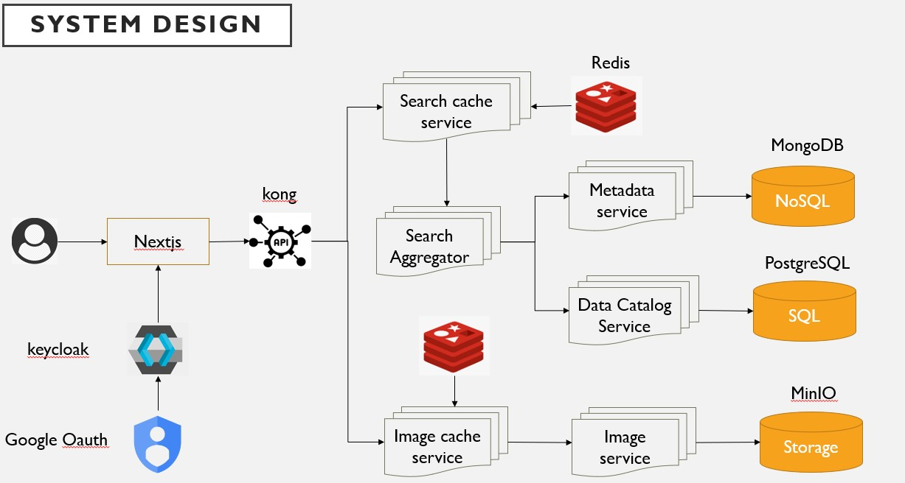

# MapleStory Drop Data Microservice Monorepo

[](https://nextjs.org/) [](https://fastapi.tiangolo.com/) [](https://www.docker.com/) [](https://kubernetes.io)

A monorepo project based on a microservice architecture, designed to provide a modern, high-performance interface to query, manage, and interact with MapleStory drop data through a Large Language Model (LLM).

## Demo

[Live Demo](https://microservice-template.mydormroom.dpdns.org/)  


---

**System Design**



## Key Features

- **Advanced Search**: Aggregated search functionality across multiple data sources.
- **LLM-Powered Chatbot**: Query drop information using natural language (powered by RAG).
- **Data Management**: Full CRUD (Create, Read, Update, Delete) operations for drop data.
- **Image Service**: Dynamic retrieval and caching of in-game mob and item images.
- **API Gateway**: Centralized and secure API management via Kong.
- **Authentication**: API endpoints secured with JWT and Keycloak.
- **Fully Containerized**: Simplified development setup using Docker and Docker Compose.
- **CI/CD Ready**: Pre-configured GitLab CI for automated builds and deployments.

## System Architecture

This project utilizes a microservice architecture. The frontend is powered by Next.js, and the backend consists of multiple independent Python (FastAPI) services, with routing managed by the Kong API Gateway.

### Services

| Service Name | Technology | Description |
| :--- | :--- | :--- |
| `frontend` | Next.js | The user interface, which interacts with the backend APIs. |
| `kong` | Kong | API Gateway that handles routing, load balancing, and authentication. |
| `ms-llm-orchestrator` | FastAPI | **Core Service**. Handles LLM chat and RAG logic. |
| `ms-search-aggregator` | FastAPI | **Search Coordinator**. Aggregates data from other services to provide search results. |
| `ms-maple-drop-repo` | FastAPI | The primary repository for drop data, using MySQL. |
| `ms-name-resolver` | FastAPI | Resolver for game entity (mob, item) names and IDs, using MongoDB. |
| `ms-image-retriever` | FastAPI | Retrieves images from MinIO object storage. |
| `ms-aggregator-cache` | FastAPI | A Redis service for caching aggregated search results. |
| `ms-image-cache` | FastAPI | A Redis service for caching images. |

### Data Stores

- **PostgreSQL** (with **pgvector**): Used by Kong and `ms-llm-orchestrator`. The `pgvector` extension enables efficient vector similarity search for the RAG pipeline.
- **MySQL**: The primary database for `ms-maple-drop-repo`.
- **MongoDB**: The primary database for `ms-name-resolver`.
- **Redis**: Used for `ms-aggregator-cache` and `ms-image-cache`.
- **MinIO**: Object storage for images.

## What is Retrieval-Augmented Generation (RAG)?

RAG stands for **Retrieval-Augmented Generation**. It is an AI framework designed to address two core challenges with Large Language Models (LLMs):

1.  **Knowledge Cutoffs**: LLMs only know about the data they were trained on and are unaware of new information or private, domain-specific knowledge (like the drop data in your database).
2.  **Hallucinations**: When lacking sufficient information, an LLM might generate plausible but incorrect or fabricated information.

### How RAG Works in This Project

The RAG process in this project can be broken down into two main steps:

1.  **Retrieval**: When a user asks a question (e.g., *"Which mobs drop 'Wisdom Crystals'?"*), the system does **not** send the query directly to the LLM. Instead, it first uses the query to search the external knowledge base (your data in **PostgreSQL with the pgvector extension**) to find the most relevant information.

2.  **Augmented Generation**: The system then "bundles" the retrieved information with the original question into a more detailed 'Augmented Prompt'. This is sent to the LLM, effectively telling it: *"Please answer the user's question based on the reference material I'm providing."*

This allows the LLM to generate a response based on real-time, accurate data from your database, rather than relying solely on its static, internal knowledge. In short, RAG gives the LLM an external "hard drive" or a "search engine" it can use to look up the latest and most accurate information on demand.

## Technology Stack

- **Frontend**: Next.js, React, TypeScript, Tailwind CSS
- **Backend**: Python, FastAPI, Uvicorn
- **API Gateway**: Kong
- **Databases/Storage**: PostgreSQL (with pgvector), MySQL, MongoDB, Redis, MinIO
- **Containerization**: Docker, Docker Compose
- **CI/CD**: GitLab CI
- **Deployment**: Kubernetes (Kustomize)

## Local Development Setup

### Prerequisites

- [Docker](https://www.docker.com/products/docker-desktop/)
- [Git](https://git-scm.com/)

### 1. Clone the Repository

```bash
git clone <your-repository-url>
cd microservice_template
```

### 2. Configure Environment Variables

Create a file named `.env` in the project root. This file contains the necessary secrets and settings for `docker-compose.yml`.

**`.env` Template:**
```env
# Password for the Postgres database used by Kong
POSTGRES_PASSWORD=your_postgres_password

# Password for the MySQL database used by ms-maple-drop-repo
ITEM_DATA_DB_PASSWORD=your_mysql_password

# Password for MinIO object storage
MINIO_ROOT_PASSWORD=your_minio_password

# Password for the Redis cache services
REDIS_PASSWORD=your_redis_password
```

### 3. Run All Services

Execute the following command in the project root to build and start all services.

```bash
docker-compose up --build -d
```
- `--build`: Forces a rebuild of the Docker images.
- `-d`: Runs containers in detached mode.

### 4. Accessing Services

- **Frontend Application**: [http://localhost:30102](http://localhost:30102)
- **Kong Admin API**: [http://localhost:8001](http://localhost:8001) (useful for checking API Gateway status)

Backend microservices are not exposed directly. All requests should be routed through the frontend or the Kong API Gateway.

## API Gateway (Kong)

This project uses Kong as its API Gateway, serving as the main entry point for backend services.

- **Declarative Configuration**: All routes and plugins are declaratively configured in `kong.yaml`.
- **Routing**: Routes incoming requests (e.g., `/stream-chat`) to the corresponding backend service (e.g., `ms-llm-orchestrator`).
- **Authentication**: Uses the `jwt` plugin to authenticate API requests, ensuring that only authorized clients can access the services.

## Deployment

The `deployment/` directory contains Kubernetes manifests for all services, managed with Kustomize. The `.gitlab-ci.yml` file defines a CI/CD pipeline for automatically building Docker images and pushing them to the `main` branch.

### Testing
**nextjs**:
```bash
npm run test:run
```
**python**:
```bash
uv sync --extra test && uv run pytest -v
```

